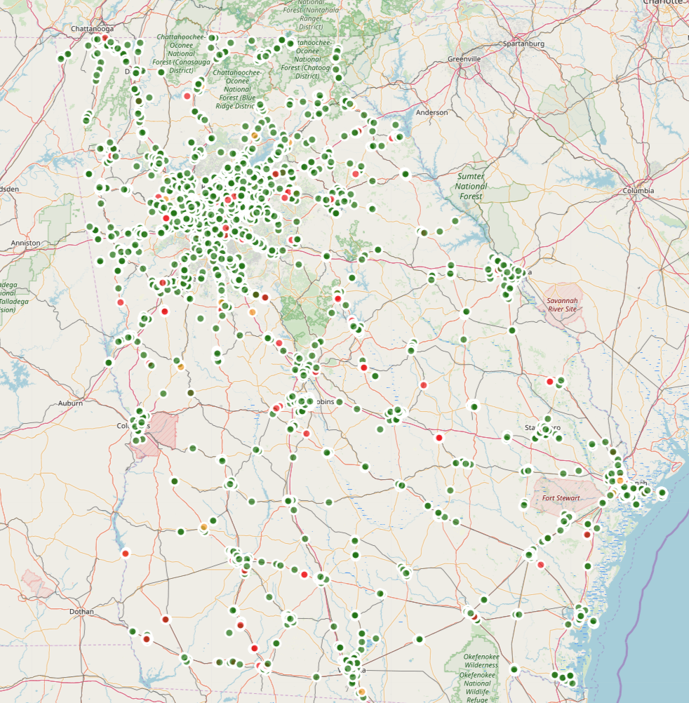
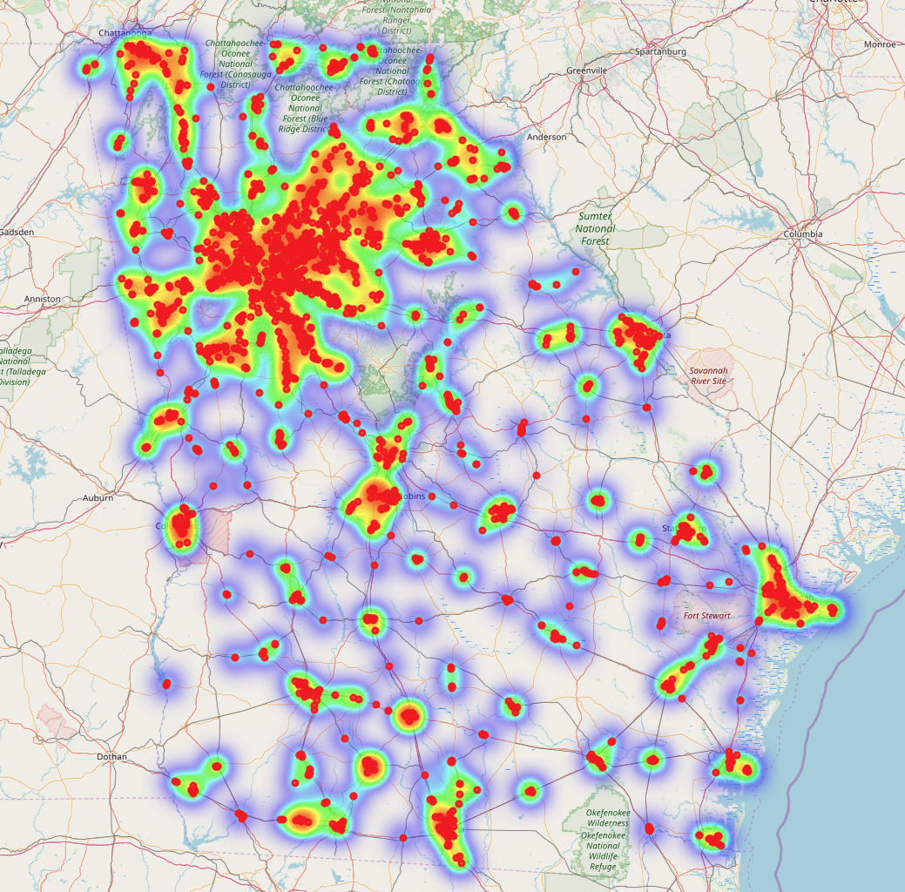

# Webmap

Create Webmaps with Python and Folium 

You can find two html files, which will show heatmap and dealers locations in Georgia, US based on json file. 
dealers_map.html will show dealers locations in Georgia, US.  
heatmap.html is a heatmap for dealers locations.

### Installing
pip install folium

### Libraries 
*folium 
*pandas

### Running 
Open html files and they will show maps on localhost.

### Dealers map Outcome

### Heatmap map Outcome

